<div align="center">



</div>

<div align="center">

# `> GUI`

```
Cybersecurity Student  ·  Blue Team  ·  Brazil 🇧🇷
```

[](https://www.linkedin.com/in/guilherme-caires-martini-8020521a3/)
[](https://tryhackme.com/p/gcairesmartini)
[](https://app.hackthebox.com/profile/gcairesmartini)

</div>

---

```bash
$ whoami
```

```
name     →  Guilherme Caires Martini
role     →  Cybersecurity Student
cert     →  Google Cybersecurity Professional ✓
edu      →  ADS @ UNICID
focus    →  Blue Team | Linux | Networking | Security
os       →  Linux
```

---

```bash
$ cat certs.txt
```

<div align="center">

[](https://www.coursera.org/professional-certificates/google-cybersecurity)

[](https://tryhackme.com/p/gcairesmartini)

</div>

---

```bash
$ cat skills.txt
```

```
DEFENSE   ████████████████░░░░  80%
LINUX     ████████████████████  95%
NETWORK   ██████████████░░░░░░  70%
PYTHON    ████████████░░░░░░░░  60%
SECURITY  █████████████████░░░  85%
```

---

```bash
$ ls tools/
```

<div align="center">


</div>

---

```bash
$ git log --oneline
```

<div align="center">

[](https://git.io/streak-stats)

[](https://github.com/GuilhermeCMartini)

</div>

---

<div align="center">

\`\`\`
0x47 0x55 0x49 · still learning · never stopping
\`\`\`


</div>
